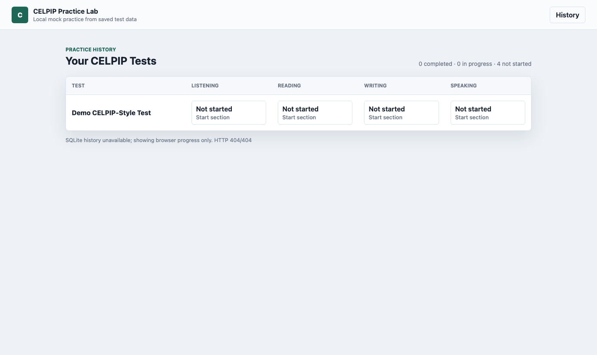
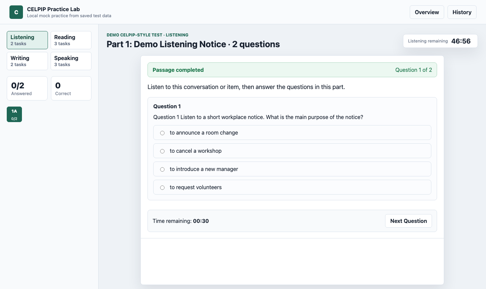
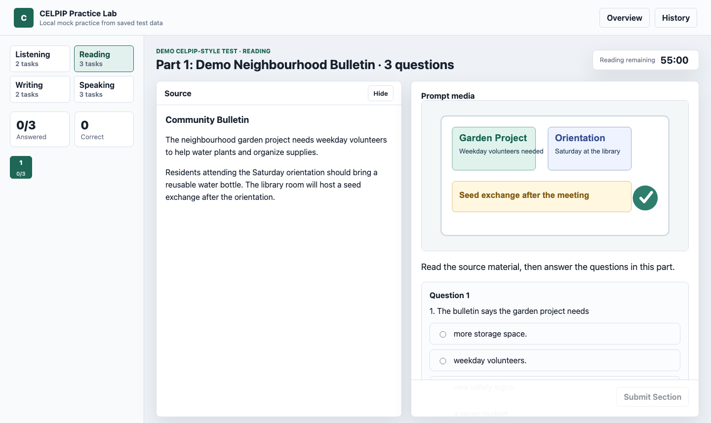
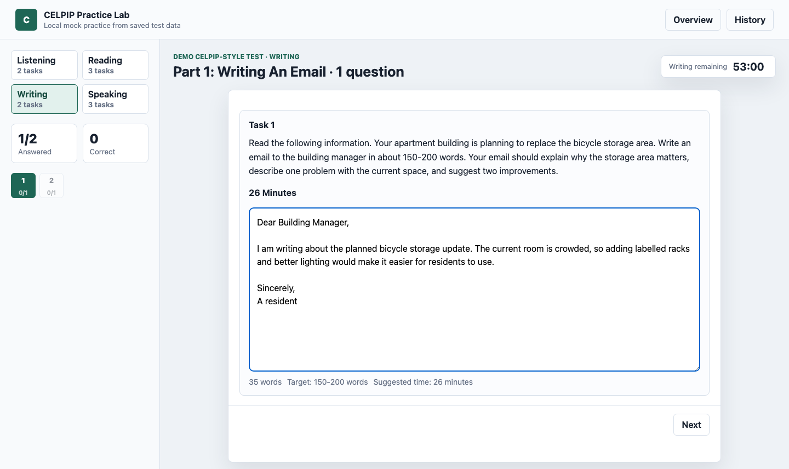
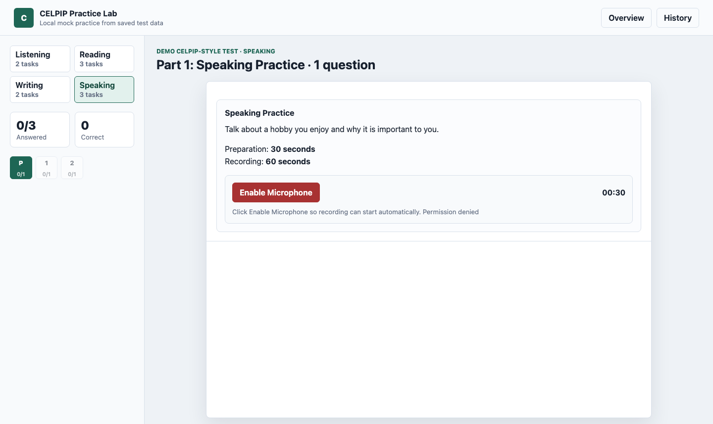
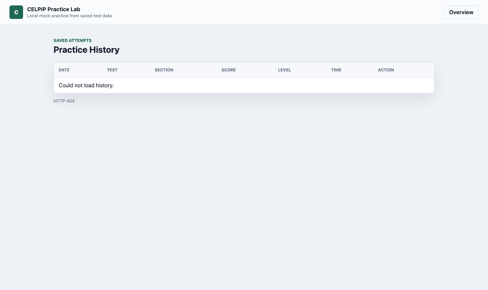

# CELPIP Practice Lab

A local CELPIP-style practice app for Listening, Reading, Writing, and Speaking. It renders material packs, saves drafts in browser localStorage, syncs attempts to SQLite, stores speaking recordings as files, and shows practice history.

No official CELPIP content is included. Public demo content is fake; real or licensed practice material must stay local.

## Screenshots

Captured from the public-safe fake demo preview.













## Quick Start

```bash
brew install uv
uv sync --frozen
cp .env.example .env
uv run python server.py
```

Open:

```text
http://127.0.0.1:8787/webapp/index.html?view=overview
```

Optional AI writing assessment uses:

```dotenv
OPENAI_API_KEY=...
```

Use `.env` only for local development. In production, inject secrets through your host's secret manager or environment variable settings.

## Data And Materials

Local development stores user data here:

```text
webapp/celpip_practice.db
webapp/recordings/
```

Private material packs are ignored by Git:

```text
materials/private/packs/<test_id>/
  material.json
  questions.json
  pages/
  audio/
  images/
  video/
```

Public fake demo material lives at:

```text
materials/demo/local_celpip1_test1/
```

The legacy `output/` folder is only an import/conversion source. The local app reads from `materials/private/packs/`.

## Public Preview

GitHub Pages builds a static fake-content preview from:

```text
webapp/
materials/demo/local_celpip1_test1/
scripts/build_pages_preview.py
```

The workflow deploys the generated `build/pages-preview/` artifact. Do not publish private packs, `.env`, SQLite DBs, recordings, or API keys to GitHub Pages.

## Deployment

For a small online server, run behind a reverse proxy and mount persistent storage:

```bash
CELPIP_DATA_DIR=/var/lib/celpip-practice
CELPIP_HOST=0.0.0.0
PORT=8787
uv run python server.py
```

Persistent production data:

```text
/var/lib/celpip-practice/webapp/celpip_practice.db
/var/lib/celpip-practice/webapp/recordings/
```

## Development

See [COOKBOOK.md](COOKBOOK.md) for workflow, tests, conversion commands, and release hygiene.
